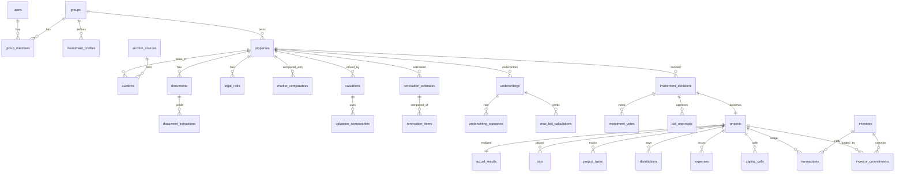

# 05 — MODELO DE DADOS

PostgreSQL (Supabase). Todas as tabelas de domínio têm `id uuid` imutável (gen_random_uuid()), `group_id`,
`created_at`, `created_by`, `updated_at`. RLS por `group_id` via `group_members`. Tabelas financeiras
(`transactions`, `distributions`, `investment_votes`, `bid_approvals`, `audit_logs`) são **append-only**:
sem UPDATE/DELETE por política e por trigger.

## Convenções de dinheiro
Cada valor monetário é um conjunto de colunas (padrão `<campo>_amount`, `<campo>_currency`, `<campo>_as_of`, `<campo>_source`)
ou, em JSON, `{ "amount": 123456, "currency": "BRL", "asOf": "2026-09-11", "source": "edital p.3" }`.
`amount` é **inteiro em centavos**. Percentuais são `numeric(9,6)` em fração (0.34).

## Estados epistêmicos
`epistemic_status`: `FACT | ESTIMATE | HYPOTHESIS | MISSING`.
`extraction_status`: `CONFIRMED | PROBABLE | UNCERTAIN | NOT_FOUND | NEEDS_HUMAN_REVIEW`.

## Diagrama (entidades e relações principais)

## Tabelas

### Identidade e acesso
- **users** — espelho de `auth.users`: `id`, `email`, `full_name`, `mfa_enabled`.
- **groups** — `id`, `name`, `slug`, `settings jsonb`.
- **group_members** — `group_id`, `user_id`, `role (ADMIN|ANALISTA|INVESTIDOR|JURIDICO|FINANCEIRO|VISUALIZACAO)`, `invited_by`, `accepted_at`. PK composta.
- **investors** — entidade econômica (pode ser pessoa do grupo ou terceira): `id`, `group_id`, `user_id?`, `name`, `document_masked`, `bank_info_encrypted`.

### Perfil de investimento (nada hardcoded)
- **investment_profiles** — `id`, `group_id`, `name`, `is_default`, `min_roi`, `target_roi`, `min_roe`, `min_irr_annual`, `min_margin`, `min_profit_amount`, `max_capital_amount`, `max_months`, `accepted_auction_types[]`, `accepted_property_types[]`, `locations jsonb`, `max_risk_level`, `default_exit_horizon_days`, `liquidity_discount_curve jsonb`, `asking_to_closing_discount`, `cost_table jsonb` (defaults de custos, ver abaixo), `team_fee jsonb`, `capital_cost_annual_rate`, `contingency_rate`, `valuation_weights jsonb`, `adjustment_coefficients jsonb`, `ranking_weights jsonb`.
  - `cost_table` (exemplo): `{ auctioneerCommissionRate: 0.05, itbiRate: 0.03, registryRate: 0.0125, deedFixed: 250000, lawyerFixed: 800000, advisoryFixed: 0, brokerageRate: 0.06, marketingFixed: 150000, capitalGainsTaxRate: 0.15, monthlyIptuAmount: null, monthlyCondoAmount: null }` — em centavos e frações.
  - `team_fee`: `{ type: "PCT_OF_BID"|"PCT_OF_PROFIT"|"FIXED"|"COMBINED", pctOfBid, pctOfProfit, fixedAmount }`.

### Imóvel e leilão
- **properties** — `id`, `group_id`, `code` (sequencial por grupo, ex. #184), `status (RADAR|TRIAGEM|EM_ANALISE|APROVADO|REPROVADO|ARREMATADO|ENCERRADO|DESCARTADO)`, `type (APARTAMENTO|CASA|TERRENO|COMERCIAL|RURAL|OUTRO)`, `address`, `number`, `complement`, `neighborhood`, `city`, `state`, `zip`, `condo_name`, `lat`, `lng`, `usable_area_m2`, `built_area_m2`, `land_area_m2`, `bedrooms`, `suites`, `parking`, `floor`, `view`, `age_years`, `building_standard (ECONOMICO|MEDIO|ALTO|LUXO)`, `condition (RUIM|REGULAR|BOM|REFORMADO|NOVO)`, `amenities jsonb`, `occupancy (DESOCUPADO|OCUPADO|DESCONHECIDO)`, `atypical_flags jsonb` (`[{code, severity, note}]`), `monthly_condo_amount`, `monthly_iptu_amount`, `notes`, `field_meta jsonb` (status epistêmico e origem por campo).
- **auction_sources** — `id`, `name`, `url`, `type (LEILOEIRO|PORTAL|API|CSV|MANUAL)`, `compliance jsonb` (api, terms, robots, lgpd, rights, checked_at).
- **auctions** — `id`, `property_id`, `source_id`, `modality (JUDICIAL|EXTRAJUDICIAL)`, `auctioneer`, `court_case_number`, `first_call_at`, `first_call_min_bid`, `second_call_at`, `second_call_min_bid`, `appraisal_value` (do edital; **fato do edital, não valor de mercado**), `commission_rate`, `payment_terms jsonb`, `debts jsonb` (condomínio, IPTU: valor, origem, responsabilidade), `url`, `raw jsonb`.

### Documentos e extrações (F2)
- **documents** — `id`, `group_id`, `property_id`, `kind (EDITAL|MATRICULA|PROCESSO|LAUDO|FOTO|OUTRO)`, `storage_path`, `sha256`, `pages`, `version`, `uploaded_by`.
- **document_extractions** — `id`, `document_id`, `field`, `value jsonb`, `page`, `excerpt`, `bbox jsonb?`, `status extraction_status`, `model`, `prompt_version`, `run_id`, `reviewed_by?`, `reviewed_at?`.
- **legal_risks** — `id`, `property_id`, `category (JURIDICO|FINANCEIRO|MERCADO|OCUPACAO|REFORMA|LIQUIDEZ|DOCUMENTAL)`, `fact`, `source_ref jsonb` (document_id, page, excerpt), `risk`, `impact`, `recommended_action`, `confidence`, `probability 1-5`, `impact_score 1-5`, `severity`, `mitigation`, `owner_user_id`, `status (ABERTO|MITIGADO|ACEITO|ENCERRADO)`, `is_critical`.

### Valuation
- **market_comparables** — `id`, `group_id`, `property_id?` (null = base geral do grupo), `source`, `url`, `captured_at`, `kind (LISTING|SOLD|GROUP_HISTORY)`, `distance_m`, `same_condo`, `same_street`, `neighborhood`, `city`, `type`, `usable_area_m2`, `bedrooms`, `suites`, `parking`, `floor`, `view`, `age_years`, `building_standard`, `condition`, `monthly_condo_amount`, `price_amount`, `price_per_m2`, `days_on_market`, `notes`, `excluded`, `excluded_reason`.
- **valuations** — `id`, `property_id`, `version`, `method`, `inputs jsonb` (pesos, coeficientes, desconto), `market_value_amount`, `market_low_amount`, `market_high_amount`, `conservative_amount`, `probable_sale_amount`, `quick_sale_amount`, `optimistic_amount`, `post_renovation_market_amount`, `exit_values jsonb` (`{ "30": {amount, low, high}, "60": …, "90": …, "120": …, "180": … }`), `exit_horizon_days`, `price_per_m2_median`, `dispersion_cv`, `effective_n`, `confidence` (0–100), `confidence_factors jsonb`, `status (OK|INSUFFICIENT_DATA|ATYPICAL)`, `is_current`.
- **valuation_comparables** — `valuation_id`, `comparable_id`, `similarity`, `adjusted_price_per_m2`, `adjustments jsonb`, `weight`, `included`.

### Reforma
- **renovation_estimates** — `id`, `property_id`, `version`, `level (NONE|COSMETIC|LIGHT|MEDIUM|HEAVY|FULL)`, `target_standard`, `region_factor`, `age_factor`, `condition_factor`, `low_amount`, `likely_amount`, `high_amount`, `contingency_rate`, `duration_weeks_low`, `duration_weeks_likely`, `duration_weeks_high`, `requires_professional_quote`, `is_current`.
- **renovation_items** — `estimate_id`, `category`, `low_amount`, `likely_amount`, `high_amount`, `basis (REFERENCE_TABLE|QUOTE|MANUAL)`, `source`, `epistemic_status`, `notes`.

### Underwriting, cenários, lance
- **underwritings** — `id`, `property_id`, `version`, `profile_id`, `valuation_id`, `renovation_estimate_id`, `reference_bid_amount`, `exit_horizon_days`, `months_total`, `inputs jsonb` (todas as linhas de custo com base, taxa, valor, status, origem), `outputs jsonb` (capital necessário, custo total, lucro bruto/líquido, ROI, ROE, TIR, margem, mensal equivalente, anualizado, capital-meses, lucro/mês), `is_current`.
- **underwriting_scenarios** — `underwriting_id`, `name (PESSIMISTA|CONSERVADOR|BASE|OTIMISTA|CUSTOM)`, `assumptions jsonb`, `outputs jsonb`, `sensitivity jsonb`.
- **max_bid_calculations** — `id`, `underwriting_id`, `ideal_amount`, `comfortable_amount`, `limit_amount`, `absolute_max_amount`, `binding_constraint`, `explanation jsonb`, `blocked_reason?`.
- **bids** — `id`, `project_id`, `auction_id`, `placed_at`, `amount`, `approved_cap_amount`, `over_cap`, `justification`, `second_approver_user_id?`, `outcome (VENCEDOR|SUPERADO|RETIRADO)`.

### Decisão
- **investment_decisions** — `id`, `property_id`, `underwriting_id`, `memo_snapshot jsonb` (memorando congelado), `decision (APROVAR|APROVAR_COM_CONDICOES|REVISAR|REPROVAR)`, `conditions jsonb[]`, `decided_at`, `version`.
- **investment_votes** — `decision_id`, `user_id`, `vote`, `note`, `voted_at`. Append-only.
- **bid_approvals** — `decision_id`, `approved_cap_amount`, `approved_by`, `approved_at`, `valid_until`, `superseded_by?`. Append-only.

### Projeto, capital e ledger (F3/F5)
- **projects** — `id`, `property_id`, `decision_id`, `stage (ARREMATADO|PAGAMENTO|DOCUMENTACAO|REGISTRO|POSSE|DESOCUPACAO|REFORMA|ANUNCIO|PROPOSTA|VENDA|ENCERRADO)`, `won_bid_amount`, `won_at`, `planned_snapshot jsonb` (previsto congelado na aprovação).
- **investor_commitments** — `project_id`, `investor_id`, `kind (FIXED|PERCENT|VARIABLE)`, `committed_amount`, `committed_pct`, `status`.
- **capital_calls** — `project_id`, `sequence`, `total_amount`, `due_at`, `purpose`, `status`.
- **transactions** (ledger, append-only) — `id`, `project_id`, `investor_id?`, `type (APORTE|DESPESA|RECEITA|REEMBOLSO|DISTRIBUICAO|AJUSTE)`, `category`, `amount` (sinal pela natureza), `occurred_at`, `paid_by_investor_id?`, `evidence_document_id?`, `description`, `reverses_transaction_id?` (correção = novo lançamento que estorna), `hash_prev`, `hash` (encadeamento simples para integridade).
- **expenses** — visão/materialização de `transactions` tipo DESPESA com `budget_category`, `planned_amount` (do snapshot) para desvio.
- **distributions** (append-only) — `project_id`, `computed_at`, `basis jsonb` (capital por investidor, participação, pró-labore, equalizações), `lines jsonb[]` (`{investor_id, amount, kind}`), `status`.
- **project_tasks** — `project_id`, `stage`, `title`, `owner_user_id`, `due_at`, `done_at`, `blocking`.
- **actual_results** — `project_id`, `renovation_actual`, `months_actual`, `sale_actual`, `cost_actual`, `roi_actual`, `irr_actual`, `computed_at` (derivado do ledger; recalculável, nunca editado à mão).

### Auditoria
- **audit_logs** (append-only) — `id`, `group_id`, `table_name`, `row_id`, `action (INSERT|UPDATE|DELETE)`, `changed_by`, `changed_at`, `old_values jsonb`, `new_values jsonb`, `reason`. Preenchido por trigger nas tabelas sensíveis.
- **ai_runs** — `id`, `group_id`, `kind`, `provider`, `model`, `prompt_version`, `input_hash`, `output jsonb`, `tokens`, `cost_amount`, `created_at`.

## Índices e restrições relevantes
- `properties (group_id, status)`, `properties (group_id, city, neighborhood)`.
- `market_comparables (group_id, city, neighborhood, type)`; índice geoespacial opcional (`earthdistance`) em F4.
- `valuations`, `renovation_estimates`, `underwritings`: índice único parcial `(property_id) WHERE is_current` garante uma versão corrente.
- `transactions`: trigger que impede UPDATE/DELETE; `hash` encadeado.
- `bid_approvals`: `valid_until` obrigatório; nova aprovação marca a anterior com `superseded_by`.

## Versionamento
Valuation, reforma, underwriting e decisão são versionados (nova linha, `is_current`). Nunca editar a versão que embasou uma aprovação.
`investment_decisions.memo_snapshot` e `projects.planned_snapshot` são cópias congeladas para o previsto × realizado.
