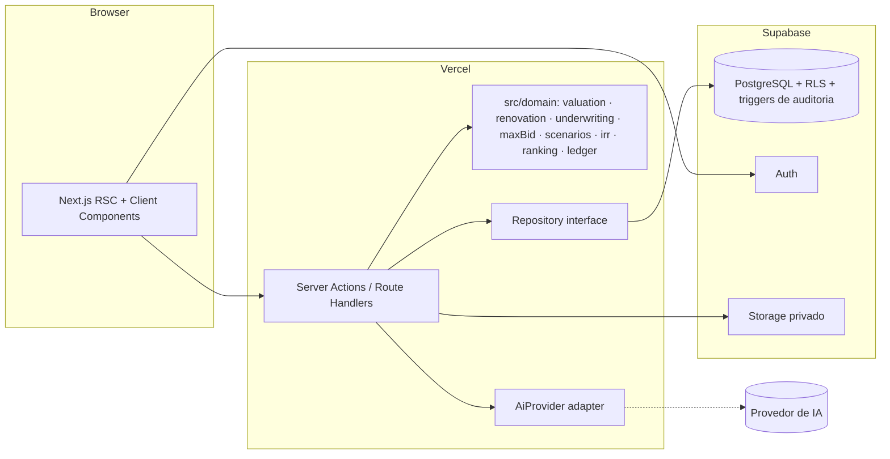

# 06 — ARQUITETURA TÉCNICA

## 1. Decisões e por quê (não é moda)

| Camada | Escolha | Por quê | Alternativa considerada |
|---|---|---|---|
| Frontend + BFF | **Next.js 15 (App Router) + React 19 + TypeScript** | Um único deploy, server components para telas densas de dados, server actions para mutações com validação no servidor; o time é pequeno e não precisa de dois repositórios | Remix, SvelteKit (menor ecossistema para o que precisamos), SPA + API separada (mais infra) |
| UI | **Tailwind CSS 3.4 + componentes próprios acessíveis (Radix primitives quando necessário)** | Controle total da estética "terminal financeiro"; sem template genérico | shadcn/ui (útil como referência, mas evitamos a estética padrão) |
| Domínio | **Pacote puro em TypeScript (`src/domain`)** sem dependência de React ou banco | Toda fórmula financeira testável isoladamente; reutilizável em jobs, CLI e futuro app | Cálculo no banco (difícil de testar/versionar) |
| Banco | **PostgreSQL (Supabase)** com RLS | Relacional, transacional, JSONB para snapshots, RLS por grupo no próprio banco, PITR | MongoDB (sem transações naturais para ledger), MySQL (RLS fraco) |
| Auth | **Supabase Auth** (e-mail/senha, TOTP opcional) | Integrado ao RLS via JWT; sem cadastro aberto (convites) | Auth0/Clerk (custo, mais um fornecedor) |
| Storage | **Supabase Storage** (buckets privados, URLs assinadas curtas) | Mesma política de acesso do banco | S3 direto (mais configuração) |
| IA | **Interface provider-agnostic (`AiProvider`)** com adaptador inicial para a API da Anthropic; chaves só no servidor | Trocar de provedor sem tocar no domínio; auditar cada execução | SDK acoplado ao provedor |
| Documentos | Pipeline: upload → hash → OCR (quando PDF sem texto) → páginas → extração estruturada com schema → citações | Rastreabilidade por página/trecho; reprocessável | RAG genérico sem estrutura |
| Testes | **Vitest** (domínio), **Playwright** (fluxos críticos) | Rápido; casos de ouro financeiros | Jest |
| Deploy | **Vercel + Supabase** | Menor custo operacional para grupo pequeno | VPS próprio (mais manutenção) |
| Observabilidade | Logs estruturados + Sentry (erros) + tabela `ai_runs` | Rastrear análises de IA e falhas de cálculo | – |

**Modo local (sem Supabase):** o repositório de dados tem uma implementação em arquivo JSON (`DATA_BACKEND=local`)
para desenvolvimento, demonstração e testes end-to-end sem credenciais. Não é para produção.

## 2. Diagrama



## 3. Estrutura de pastas

```
src/
  app/                 rotas (App Router), layouts, páginas
  components/          UI (design system próprio: Money, Range, Confidence, EpistemicBadge, DataTable…)
  domain/              LÓGICA PURA (sem React, sem banco)
    money.ts           centavos, arredondamento, formatação
    irr.ts             TIR/XIRR (Newton + bisseção)
    valuation/         similaridade, ajustes, estatística robusta, confiança, saída por prazo, atipicidade
    renovation/        tabela de referência, estimador, ponto ótimo
    underwriting/      linhas de custo, métricas, taxa da equipe, IR
    maxBid/            solver por bisseção, patamares, restrições
    scenarios/         cenários e sensibilidade
    ranking/           score decomponível (F4)
    ledger/            participações, distribuições, equalizações (F3)
  data/                Repository interface + adapters (supabase, local)
  server/              server actions, auth helpers, rbac
  ai/                  AiProvider interface + adapters (F2)
supabase/
  migrations/          SQL versionado (schema, RLS, triggers)
  seed.sql
docs/                  este conjunto de documentos
tests/                 vitest (domínio) e playwright (e2e)
```

## 4. Motor financeiro (especificação)

Notação: valores em centavos inteiros; taxas em fração; `B` = lance.

### 4.1 Custos de aquisição (dependem de `B`)
```
comissao       = B × auctioneerCommissionRate
itbi           = B × itbiRate                         (base: maior entre B e valor venal quando informado; configurável)
registro       = B × registryRate + registryFixed
carta/custas   = fixos configuráveis
advogado       = fixo ou % configurável
assessoria     = fixo
debitos        = condomínio em atraso + IPTU em atraso (do edital; responsabilidade configurável por modalidade)
desocupacao    = custo fixo estimado + meses de desocupação × (condomínio + IPTU mensais)
reforma        = do estimador (baixa/provável/alta conforme cenário)
carregamento   = mesesTotais × (condomínio mensal + IPTU mensal + seguros)
contingencia   = contingencyRate × (custos acima excluindo B)
```

### 4.2 Custos de venda (dependem de `V` = valor de saída)
```
corretagem     = V × brokerageRate
marketing      = fixo
taxasVenda     = fixos
```

### 4.3 Capital e custo de capital
```
capitalNecessario = B + custosAquisicao + reforma + carregamento + contingencia   (pico de caixa; sem financiamento)
custoCapital      = capitalNecessario × ((1 + capitalCostAnnualRate)^(meses/12) − 1)   (custo de oportunidade; linha informativa que entra no lucro econômico)
```
Com financiamento (F2+): `capitalProprio = capitalNecessario − financiado`; `juros = financiado × taxa × meses`; ROE usa capital próprio.

### 4.4 Imposto sobre ganho de capital
```
custoAquisicaoDeclaravel = B + comissao + itbi + registro + reforma (documentada)   (configurável quais entram)
ganho                    = max(0, V − custoAquisicaoDeclaravel)
ir                       = ganho × capitalGainsTaxRate           (PF 15% default; PJ configurável; validar com contador)
```

### 4.5 Taxa da equipe (resolve circularidade)
```
lucroAntesTaxa = V − custosVenda − ir − capitalNecessario − custoCapital
PCT_OF_BID:     taxa = B × pctOfBid
FIXED:          taxa = fixed
PCT_OF_PROFIT:  taxa = max(0, lucroAntesTaxa) × pctOfProfit
COMBINED:       soma das anteriores
lucroLiquido   = lucroAntesTaxa − taxa
```

### 4.6 Métricas
```
custoTotal      = capitalNecessario + custosVenda + ir + taxa + custoCapital
lucroBruto      = V − capitalNecessario
ROI             = lucroLiquido / capitalProprio
ROE             = ROI sem financiamento; com financiamento, lucroLiquido / capitalProprio (após juros)
margem          = lucroLiquido / V
mensalEquiv     = (1 + ROI)^(1/meses) − 1
anualizado      = (1 + ROI)^(12/meses) − 1
capitalMeses    = Σ (saldo de capital investido em cada mês)   (a partir do fluxo de caixa)
lucroPorMesCap  = lucroLiquido / meses
TIR             = XIRR do fluxo mensal: t0 = −(B + custos iniciais); meses de obra = −reforma/n; carregamento mensal; tN = +V − custosVenda − ir − taxa
```

### 4.7 Lance máximo (solver)
`f(B) = ROI(B, V_cenário) − ROI_exigido` é estritamente decrescente em `B` (todos os custos que dependem de `B` são crescentes; `V` fixo).
Bisseção em `[0, V]` com tolerância de 100 centavos, máximo 200 iterações. Restrições adicionais resolvidas da mesma forma
(lucro mínimo, TIR mínima) ou por limite direto (capital máximo → resolve `capitalNecessario(B) = capMax`). Teto = mínimo entre todas; a restrição ativa é reportada.

Patamares: IDEAL (ROI-alvo, V conservador) · CONFORTÁVEL (ROI-alvo, V base) · LIMITE (ROI mín., V conservador) · MÁXIMO ABSOLUTO (ROI mín., V base).

### 4.8 Valuation
```
s_i = Π_k w_k-ponderado de similaridades por atributo (localização, área, quartos, vagas, andar, idade, padrão, estado) ∈ [0,1]
ppm2_adj_i = ppm2_i × Π (1 + coef_k × Δ_k) × (1 − descontoAnuncio se LISTING)
mediana ponderada por s_i de ppm2_adj → valorMercado = mediana × área
faixa = P25–P75 ponderados; CV = desvio/média ponderados; n_ef = Σ s_i
confiança = clamp(0..100, base 50 + f(n_ef) + f(CV) + f(sim média) + f(idade dos dados) + f(completude) − penalidade atípica)
provável = mercado × (1 − descontoAnuncioFechamento)   [se comparáveis já são SOLD, desconto = 0]
saída(h) = provável_pósReforma × (1 − curvaLiquidez[classe][h])
```

## 5. Segurança
- RLS em todas as tabelas: `group_id IN (select group_id from group_members where user_id = auth.uid())` + checagem de papel para escrita via função `has_role(group_id, roles[])`.
- Server actions validam entrada com Zod e re-verificam papel (defesa em profundidade; nunca confiar só no cliente).
- Segredos (`SUPABASE_SERVICE_ROLE_KEY`, chaves de IA) apenas em variáveis de ambiente do servidor; o cliente recebe apenas a chave anônima.
- Rate limiting (Upstash ou tabela de quotas) em rotas de IA e upload.
- Documentos: bucket privado; URLs assinadas com validade de minutos; hash SHA-256 para integridade.
- Ledger: triggers `RAISE EXCEPTION` em UPDATE/DELETE; hash encadeado.
- Auditoria por trigger em tabelas sensíveis.
- Backups: PITR do Supabase; export semanal para storage frio (F3).
- LGPD: dados de devedores extraídos de editais ficam restritos ao grupo; retenção configurável; log de acesso a documentos.

## 6. Coleta de dados externa (F4)
Antes de qualquer conector: checklist `auction_sources.compliance` (api, termos, robots, LGPD, direitos). Sem conformidade plena, o conector não é habilitado; ficam CSV, bookmarklet e extensão autorizada (que só envia o que a usuária está vendo e escolheu enviar).

## 7. Performance
- Cálculos do domínio são O(n comparáveis) e O(iterações) — executam em < 50 ms no servidor; resultados persistidos como versão.
- Listas com paginação por cursor; índices por `(group_id, status)`.
- Sensibilidade (grades 6×6) calculada no servidor e cacheada na versão do underwriting.
